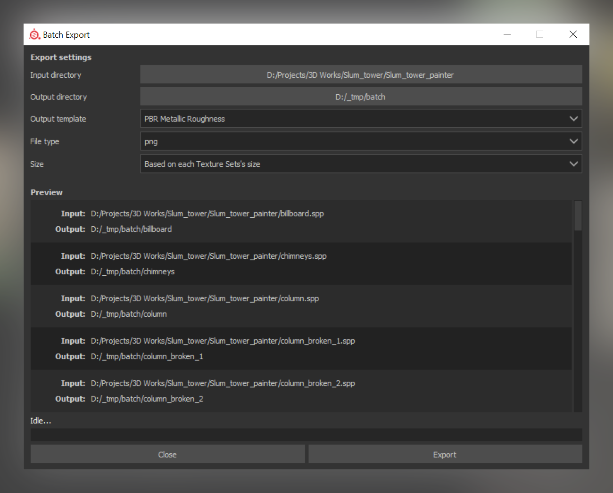

# Substance Batch Export

This plugin exports all the Substance projects on a folder, given a destination, template, format and size.

## Installation

Download or clone this project into the Substance Painter plugins folder. The plugins folder can be opened from Substance Painter through the menu ``Plugins/Plugins folder``.

## Usage

Click on the double cogwheel icon in the toolbar on the side. The first you open the plugin, it will ask for the directory of Substance Painter executable. This is needed to fetch the export templates. This setting can be changed later using the **configuration panel** through ``Plugins/batch-export/configure``.

## License

Distributed under the MIT license. See [LICENSE](LICENSE) file for more information.